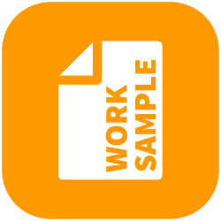

# Frontend Worksample for Odd Hill

### Created july 2017 



- Angular (Latest version 4)
- Sass as CSS-Precompiler
- Bootstrap
- ng-font-awesome for the icons
- rapid prototyping for the menu & filters in Adobe XD

---------------

## Installation

Clone or download the source files & install dependencies:

```sh
$ npm install
```

## Start up

Run the app:

```sh
$ npm start
```

Go to http://localhost:4200

----------------

by Ola Frick // [profile link](https://www.linkedin.com/in/olafrick)
